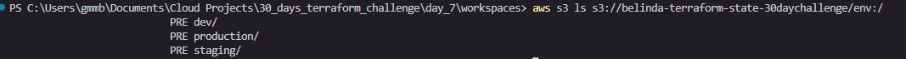
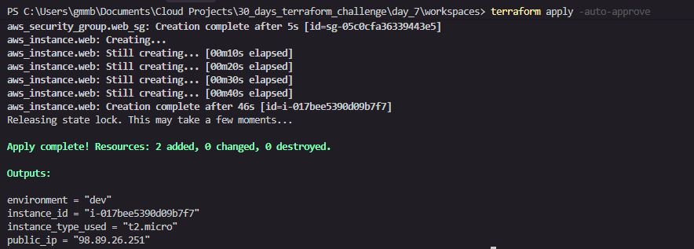
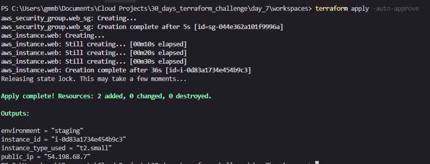
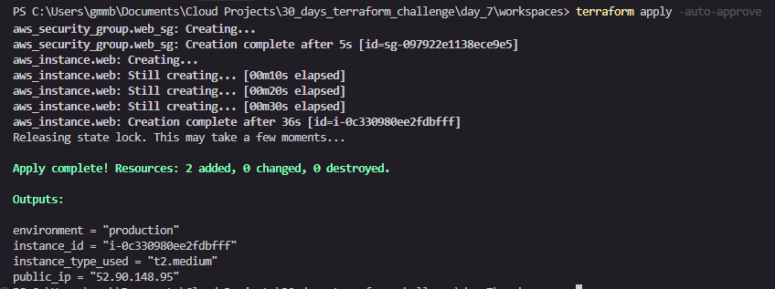
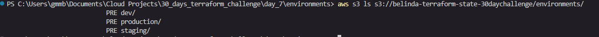
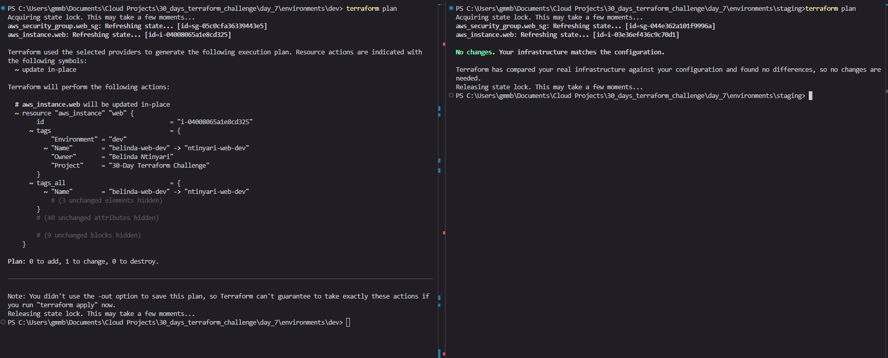
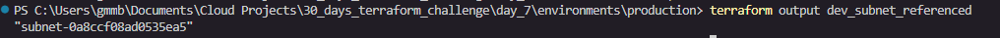

# Day 7 — Terraform Workspaces vs File Layout

**30-Day Terraform Challenge | Belinda Ntinyari**

---

## What This Project Is About

When you build real cloud infrastructure, you almost always need multiple environments — a **dev** environment where you experiment freely, a **staging** environment where you test before going live, and a **production** environment where real users are. The big question is: **how do you manage all three without them interfering with each other?**

This project answers that question by demonstrating two completely different approaches side by side:

| Approach | Folder | How it works |
|---|---|---|
| Terraform Workspaces | `workspaces/` | One set of code, multiple environments via workspace switching |
| File Layout | `environments/` | Separate folder per environment, each fully independent |

By the end of this project you will understand what each approach does, how state isolation works, and which approach is better for real-world use.

---

## What Is Terraform State?

Before diving in, you need to understand **state**. Terraform keeps a record of every resource it has created in a file called `terraform.tfstate`. This file is Terraform's memory — it knows what exists in AWS because of this file.

If two environments share the same state file, a change in dev could accidentally destroy production. **State isolation** means each environment has its own separate state file so they can never interfere with each other.

In this project, all state files are stored remotely in an **S3 bucket** (`belinda-terraform-state-30daychallenge`) so they are safe, shared across machines, and versioned.

---

## Project Structure

```
day_7/
├── workspaces/                        # Approach 1: Terraform Workspaces
│   ├── workspaces_main.tf             # One file that deploys to any environment
│   └── workspaces_variables.tf        # Variables including instance type map
│
├── environments/                      # Approach 2: File Layout
│   ├── dev/
│   │   ├── dev_backend.tf             # Points state to environments/dev/terraform.tfstate
│   │   ├── dev_main.tf                # Dev-specific infrastructure
│   │   └── dev_variables.tf           # Dev defaults (t2.micro)
│   ├── staging/
│   │   ├── staging_backend.tf         # Points state to environments/staging/terraform.tfstate
│   │   ├── staging_main.tf            # Staging infrastructure
│   │   └── staging_variables.tf       # Staging defaults (t2.small)
│   └── production/
│       ├── production_backend.tf      # Points state to environments/production/terraform.tfstate
│       ├── production_main.tf         # Production infrastructure + remote state data source
│       └── production_variables.tf    # Production defaults (t2.medium)
│
└── images/                            # Screenshots of all test results
```

---

## Prerequisites

Before running this project you need:

- [Terraform](https://developer.hashicorp.com/terraform/install) installed (v1.10 or later)
- [AWS CLI](https://aws.amazon.com/cli/) installed and configured (`aws configure`)
- An AWS account with permissions to create EC2 instances, Security Groups, and S3 buckets
- The S3 bucket `belinda-terraform-state-30daychallenge` must exist before running `terraform init` — we are using a bucket created on Day 6 of the challenge

Create the S3 bucket with versioning enabled:
```bash
aws s3api create-bucket --bucket belinda-terraform-state-30daychallenge --region us-east-1
aws s3api put-bucket-versioning --bucket belinda-terraform-state-30daychallenge --versioning-configuration Status=Enabled
```

---

## Approach 1 — Terraform Workspaces

### The Concept

Think of workspaces like tabs in a browser. You have one browser (one set of Terraform code) but multiple tabs open at the same time (dev, staging, production). Each tab has its own session and history, that is what workspaces do for state files.

With workspaces, you write your infrastructure code **once** in `workspaces/workspaces_main.tf` and Terraform automatically adjusts based on which workspace is active using the built-in variable `terraform.workspace`.

### How the Code Works

The instance type is defined as a **map** in `workspaces_variables.tf`:

```hcl
variable "instance_type" {
  type = map(string)
  default = {
    dev        = "t2.micro"
    staging    = "t2.small"
    production = "t2.medium"
  }
}
```

In `workspaces_main.tf`, Terraform looks up the right size automatically:

```hcl
instance_type = var.instance_type[terraform.workspace]
```

So when you are in the `dev` workspace, `terraform.workspace` returns `"dev"` and Terraform picks `t2.micro`. Switch to `production` and it picks `t2.medium`; same code, different result.

Resource names also include the workspace name so they never clash:

```hcl
name = "belinda-web-sg-${terraform.workspace}"
```

### How State Is Isolated in Workspaces

All workspaces share the same S3 bucket and the same base key, but Terraform automatically adds a prefix for non-default workspaces:

```
day7/workspaces/terraform.tfstate          ← default workspace
day7/workspaces/env:/dev/terraform.tfstate
day7/workspaces/env:/staging/terraform.tfstate
day7/workspaces/env:/production/terraform.tfstate
```

Each environment gets its own state file automatically, you do not configure this manually.

### How to Deploy with Workspaces

```bash
cd workspaces/

terraform init

# Create and deploy dev
terraform workspace new dev
terraform plan
terraform apply

# Create and deploy staging
terraform workspace new staging
terraform plan
terraform apply

# Create and deploy production
terraform workspace new production
terraform plan
terraform apply

# See all workspaces
terraform workspace list

# Switch back to dev
terraform workspace select dev
```

---

## Approach 2 — File Layout

### The Concept

Instead of one folder with workspace switching, the file layout approach gives each environment its own completely separate folder. Each folder is an independent Terraform project with its own backend, its own variables, and its own state file. There is no shared code at all.

Think of it like having three separate houses instead of three rooms in one house. Each house has its own address, its own keys, and its own rules.

### How the Code Works

Each environment folder has three files:

- `*_backend.tf` — tells Terraform where to store the state file for that environment
- `*_main.tf` — defines the actual AWS resources (EC2, Security Group)
- `*_variables.tf` — sets the default values specific to that environment

The instance type is hardcoded per environment in each `*_variables.tf`:

| Environment | Instance Type | Why |
|---|---|---|
| dev | t2.micro | Cheapest, Free Tier eligible, good enough for development |
| staging | t2.small | Slightly larger, closer to production for realistic testing |
| production | t2.medium | Production-grade, handles real traffic |

Each backend points to a unique S3 key:

```
environments/dev/terraform.tfstate
environments/staging/terraform.tfstate
environments/production/terraform.tfstate
```

Because these are completely different files in S3, it is physically impossible for a change in dev to affect production state.

### The Remote State Data Source (Production)

The production environment demonstrates an advanced feature; reading outputs from another environment's state file without hardcoding values. In `production_main.tf`:

```hcl
data "terraform_remote_state" "dev" {
  backend = "s3"
  config = {
    bucket = "belinda-terraform-state-30daychallenge"
    key    = "environments/dev/terraform.tfstate"
    region = "us-east-1"
  }
}
```

This reads the dev state file and pulls out the `subnet_id` output that dev exposed. Production then places its EC2 instance in the same subnet as dev:

```hcl
subnet_id = data.terraform_remote_state.dev.outputs.subnet_id
```

This is useful in real projects where one team manages networking and another team manages applications — the app team reads the network team's state to get VPC and subnet IDs without needing to know the details.

### How to Deploy with File Layout

```bash
# Deploy dev first (production reads its state)
cd environments/dev/
terraform init
terraform plan
terraform apply

# Deploy staging
cd ../staging/
terraform init
terraform plan
terraform apply

# Deploy production
cd ../production/
terraform init
terraform plan
terraform apply
```

---

## Workspaces vs File Layout — Which Should You Use?

| | Workspaces | File Layout |
|---|---|---|
| Code duplication | None — one set of code | Each environment has its own files |
| Isolation | State files are isolated | Everything is isolated (state + code + config) |
| Risk of mistakes | Higher — easy to apply to wrong workspace | Lower — you must be in the right folder |
| Flexibility | Limited — environments must share the same structure | Full — each environment can be completely different |
| Best for | Simple projects, learning, small teams | Production systems, large teams, complex environments |
| Recommended by HashiCorp | For simple cases only | Yes, for most real-world use |

**The verdict:** File layout is the industry standard for production infrastructure. Workspaces are great for learning and simple use cases but carry the risk of accidentally running `terraform apply` in the wrong workspace.

---

## Tests and Verification

### Test 1 — Verify Workspace State Isolation

This test proves that each Terraform workspace stores its state in a separate file in S3, so environments cannot interfere with each other.

**Command:**
```bash
aws s3 ls s3://belinda-terraform-state-30daychallenge/day7/env:/
```

**Expected output:** Three separate state file paths, one per workspace.

**Screenshot:**



**What this proves:** Even though all three workspaces use the same Terraform code and the same S3 bucket, each has its own isolated state file. Destroying dev will never touch staging or production state.

---

### Test 2 — Confirm Correct Instance Type Per Workspace

This test verifies that the instance type map in `workspaces_variables.tf` correctly selects the right EC2 size for each workspace automatically.

**Commands:**
```bash
# In workspaces/ directory
terraform workspace select dev
terraform output instance_type_used

terraform workspace select staging
terraform output instance_type_used

terraform workspace select production
terraform output instance_type_used
```

**Expected results:**

| Workspace | Expected Instance Type |
|---|---|
| dev | t2.micro |
| staging | t2.small |
| production | t2.medium |

**Screenshots:**

Dev workspace apply:


Staging workspace apply:


Production workspace apply:


**What this proves:** The single line `var.instance_type[terraform.workspace]` is enough to deploy the correct infrastructure size per environment with zero code duplication.

---

### Test 3 — Verify File Layout State Isolation

This test proves that the file layout approach stores each environment's state in a completely separate S3 key, making cross-environment interference impossible.

**Command:**
```bash
aws s3 ls s3://belinda-terraform-state-30daychallenge/environments/ 
```

**Expected output:** Three separate state files at distinct paths.

**Screenshot:**



**What this proves:** Unlike workspaces where isolation is automatic, the file layout makes isolation explicit and visible. Each environment's state lives at a hardcoded unique path, there is no mechanism by which one environment could overwrite another's state.

---

### Test 4 — Prove Environments Don't Affect Each Other

This is the most important test. Make a small change in dev, "update a tag"  and confirm staging is completely unaffected.

**How to run:**
1. In `environments/dev/dev_main.tf`, update a tag value (e.g. change the `Name` tag)
2. Run `terraform plan` from `environments/dev/`; it will show 1 change
3. Switch to `environments/staging/` and run `terraform plan`, it should show no changes at all

**Commands:**
```bash
# In dev, change a tag in main.tf then run plan
cd environments/dev
terraform plan
# shows 1 change

# Switch to staging and run plan
cd ../staging
terraform plan
# should show: No changes. Infrastructure is up-to-date.
```

If staging shows no changes, isolation is working perfectly.

**Screenshot:**



**What this proves:** The file layout's physical separation of state files means environments are truly independent. A change — or even a `terraform destroy` — in dev will not touch a single resource in staging or production.

---

### Test 5 — Verify Remote State Data Source

This test proves that the production environment can read outputs from the dev environment's state file and use them to place resources correctly, without hardcoding any values.

**Command (from `environments/production/`):**
```bash
terraform output dev_subnet_referenced
```

**Expected output:** A subnet ID (e.g. `subnet-0abc123...`) that matches the `subnet_id` output from the dev environment.

**Verify it matches dev:**
```bash
cd ../dev/
terraform output subnet_id
```

Both commands should return the same subnet ID.

**Screenshot:**



**What this proves:** `terraform_remote_state` allows environments to share information through state outputs without sharing code or state files. Production reads dev's subnet ID at plan time. If dev's subnet changes, production will pick up the new value on its next `terraform apply`.

---

## Cleaning Up

To avoid ongoing AWS charges, destroy resources when done.

**Workspaces:**
```bash
cd workspaces/
terraform workspace select production
terraform destroy

terraform workspace select staging
terraform destroy

terraform workspace select dev
terraform destroy
```

**File Layout:**
```bash
cd environments/production/
terraform destroy

cd ../staging/
terraform destroy

cd ../dev/
terraform destroy
```

---

## Key Takeaways

- **State isolation** is non-negotiable in real infrastructure. Without it, a mistake in dev can destroy production.
- **Workspaces** isolate state automatically but share code, great for learning, risky in production because it is easy to run commands in the wrong workspace.
- **File layout** isolates everything; state, code, and configuration, making it the safer and more flexible choice for real teams.
- **Remote state data sources** allow environments to share information (like subnet IDs) without coupling their infrastructure code together.
- **S3 as a remote backend** means your state is safe, versioned, and accessible from any machine, never store state files locally in a team environment.

---

*Belinda Ntinyari — Day 7 of the 30-Day Terraform Challenge*
